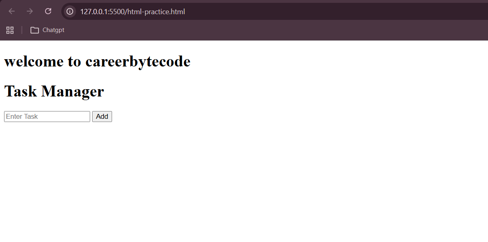
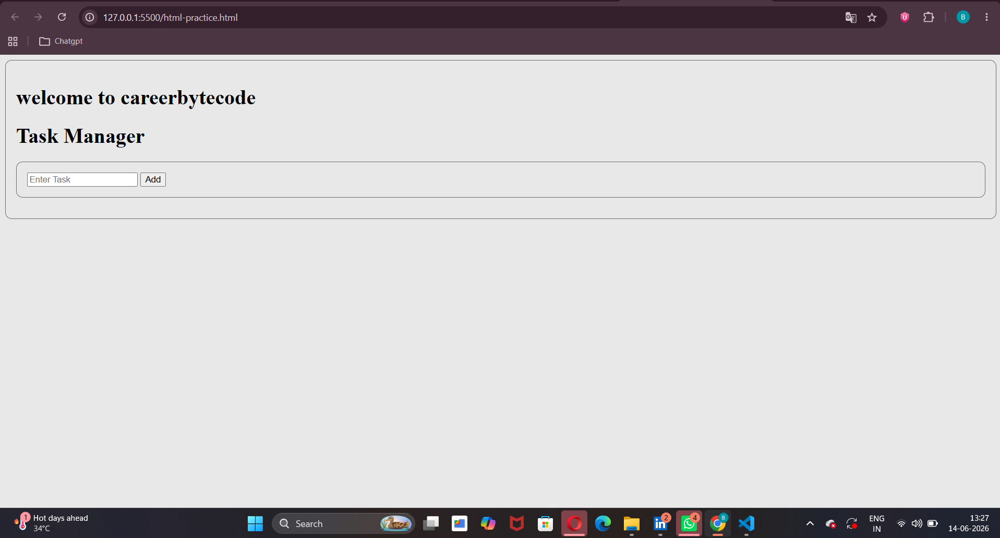
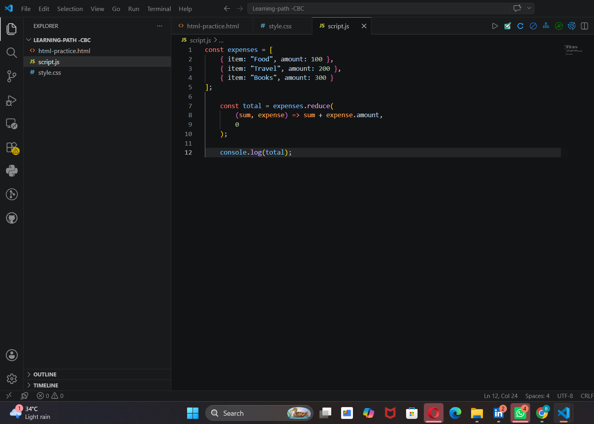
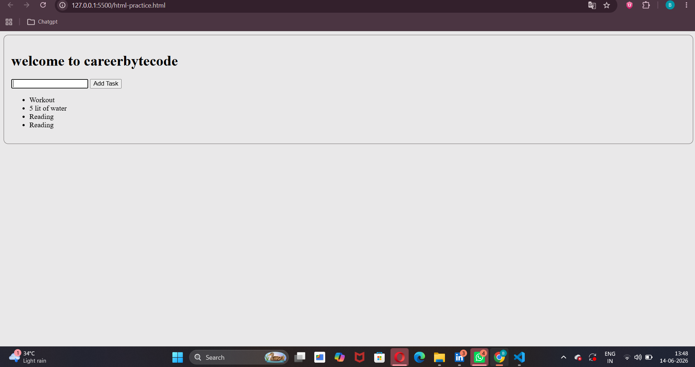

**Module 0**
this module helped me strenghten my understanding of the fundamental technologies used in web development and prepared me for frontend applications.

**What i learned**
# 1.HTML-building the structure 
-Creating a basic HTML page
-Forms and user input fields
-Lists, headings, links, and text areas
-Using id and class attributes

#Task one
'''<!DOCTYPE html>
<html lang="en">
    <head>
        <title>My app</title>
    
    </head>
    <body>
        <h1>welcome to careerbytecode</h1>
    
        <h1>Task Manager</h1> 
        <form id="addForm"> 
            <input id="title" placeholder="Enter Task"> 
            <button>Add</button> 
        </form> 
        <ul id="list"></ul>

    </body>
</html>
'''

# 2.CSS-Styling the page 
key concepts i learned 
-selectors(tag,class,id)
-flexboy layout
-card design
-Responsive design using media queries
**Task 2**
'''.card { 
    padding: 16px; 
    border-radius: 10px;
    background-color: #e9e8e9;
    border: 1px solid #6e6a6a; 
}
.row 
{ display: flex; gap: 12px; }
'''

# 3.JavaScript Fundamentals 
i learnt that JavaScript adds logic and interactivity to webpages.

Key Concepts Learned
-Variables
-Arrays
-Objects
-Functions
-Array Methods:
  map()
  filetr()
  reduce()

***Example:***

JavaScript allows us to process data and create dynamic applications.

# 4.DOM Manipulation and events
the DOM connects java script with HTML

KEY concepts i learned
-Selecting elements
-Reading user input
-Handling form submissions
-Updating webpage content dynamically

Example
'''document
  .querySelector("#addForm")
  .addEventListener("submit", (e) => {
    e.preventDefault();
    console.log("Form Submitted");
  });
 ''' 
DOM manipulation makes webpages interactive and responsive to user actions.

# 5.LocalStorage
localStorage allows data to persist even after refreshing the page.

Key Concepts Learned
-Saving data
-Loading data
-Using JSON.stringify()
-Using JSON.parse()

***Example***
'''
const tasks = [ 
    { id: 1, text: "Learn HTML" } 
]; 

localStorage.setItem( 
    "tasks",
    JSON.stringify(tasks) 
);
const savedTasks = 
    JSON.parse( localStorage.getItem("tasks") || "[]" 
);
'''
**Takeaway**
localStorage is useful for frontend projects that need persistent data without a backend.

# 6.GitHub and git
Git helps track changes, while GitHub stores code online.

Key Concepts Learned
-Cloning repositories
-Creating branches
-Committing changes
-Pushing code
-Pull Requests

**Common Commands**
>git add .
>git commit -m "message"
>git push origin intern/balaji

**Takeaway**
Git enables version control and collaboration with other developers.

# 7.Deployment 
I learned how to make frontend projects accessible online.

**Deployment Options**
     GitHub Pages
     Netlify

**Benefits**
Share projects with others
Add live links to portfolios
Demonstrate working applications

